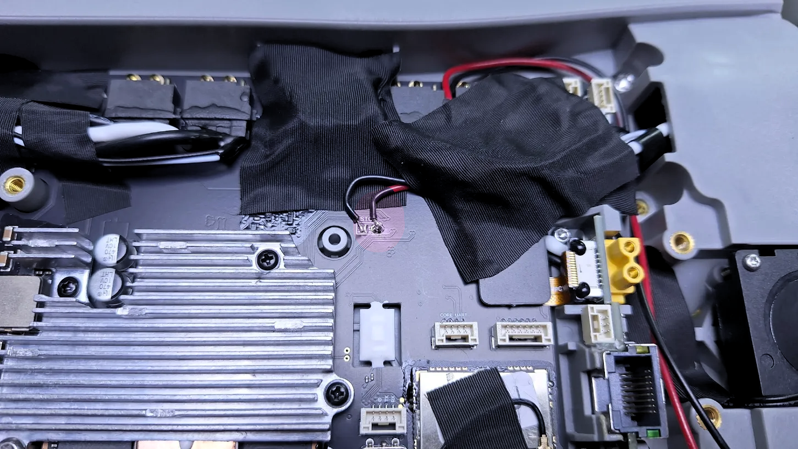
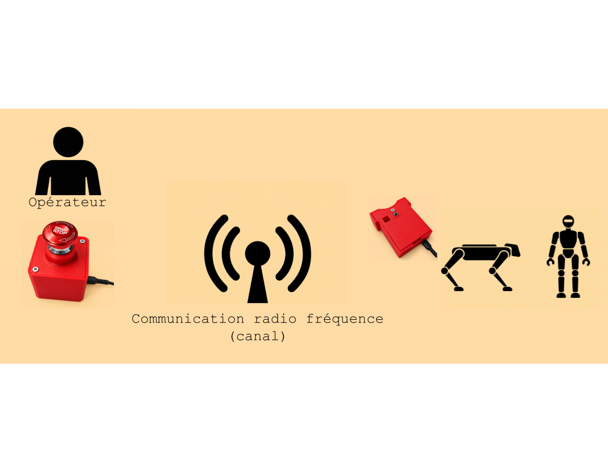
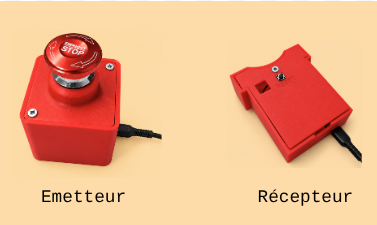
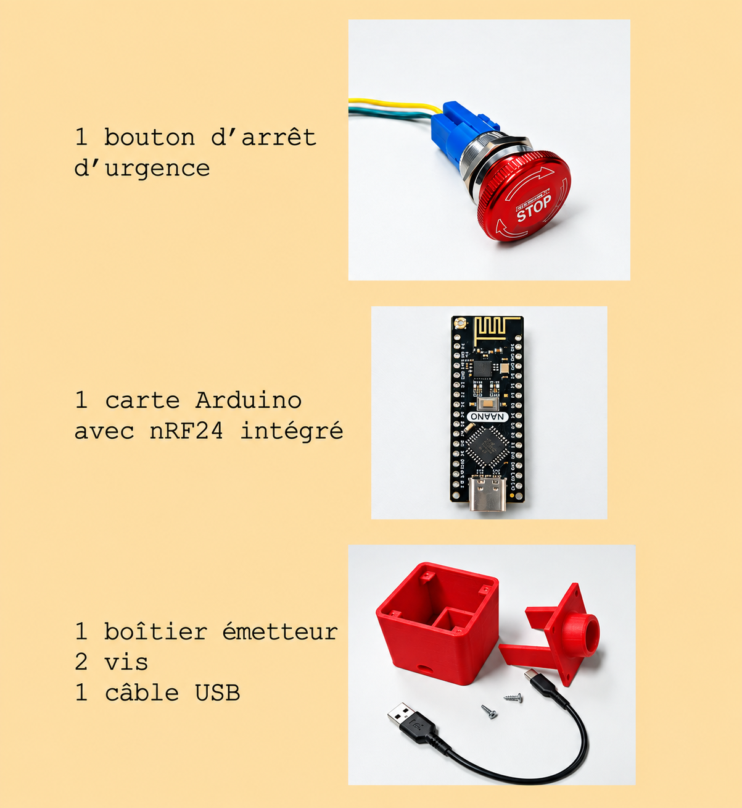
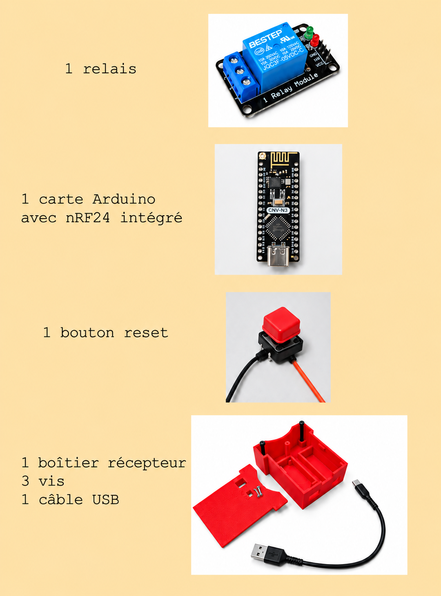
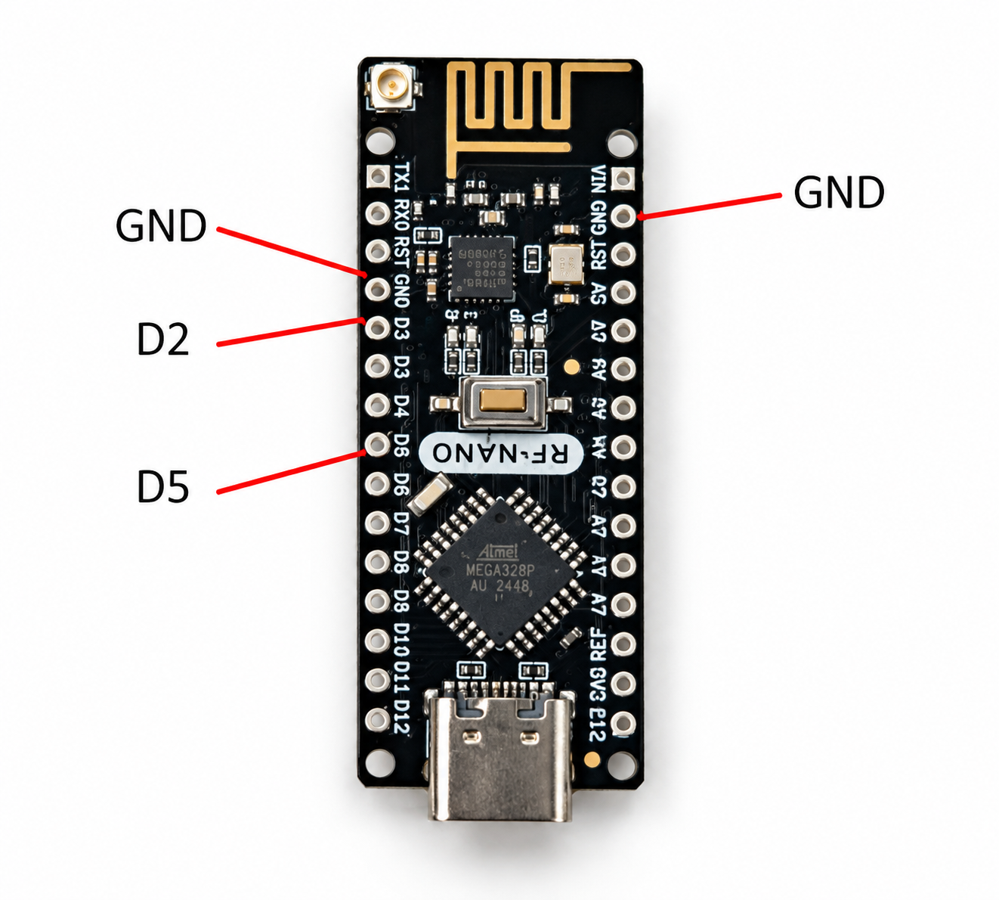
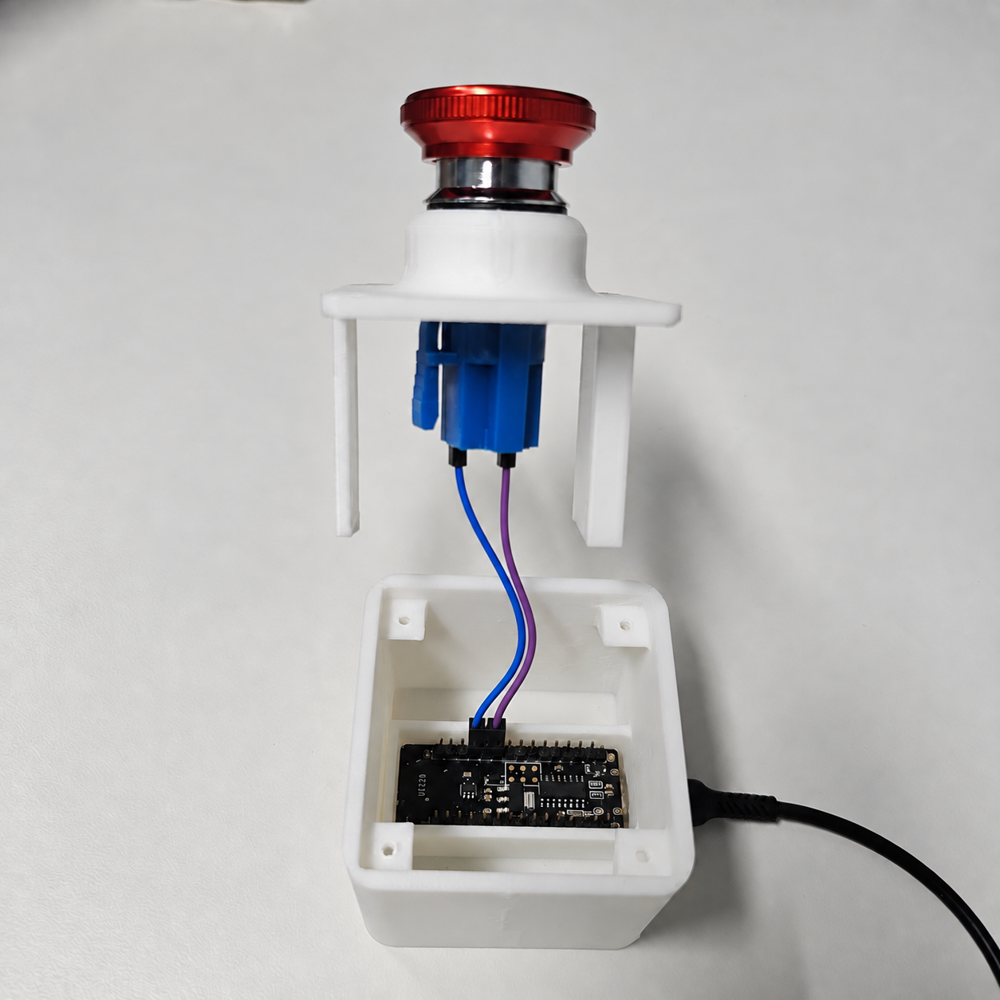
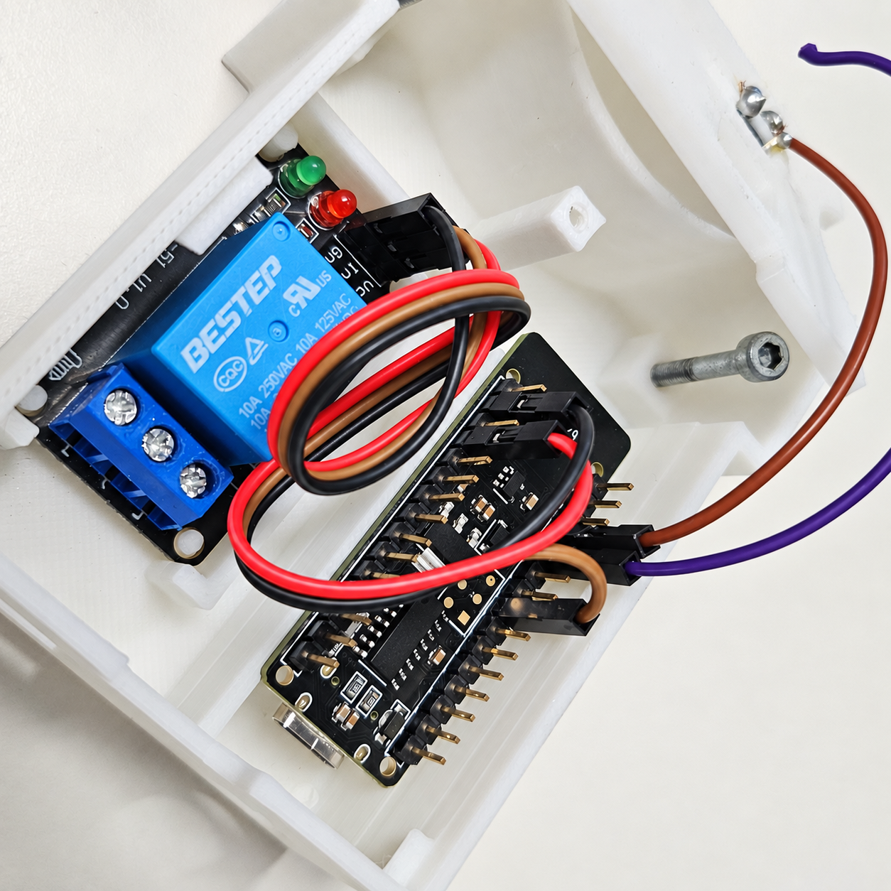
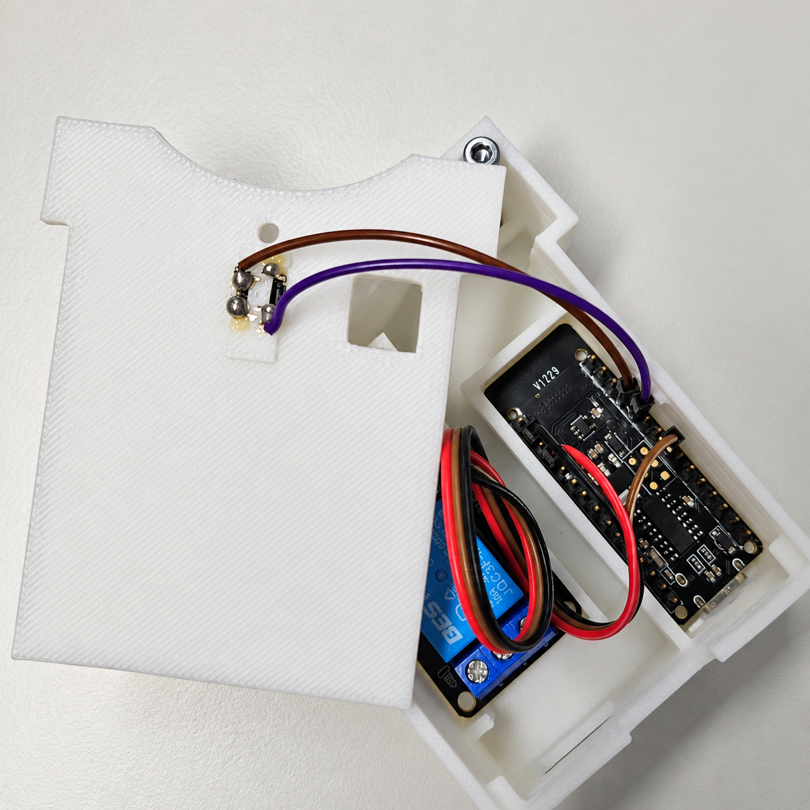
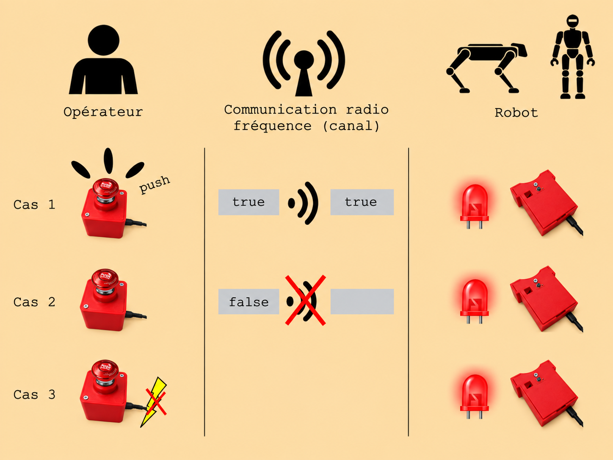

 <p align="center">
  
  <br>
 </p>
 
 <div align="justify">
Le réseau métier des roboticiens et mécatroniciens du CNRS organise des journées thématiques sur les robots quadrupèdes et humanoïdes afin de favoriser le partage de connaissances et les retours d’expérience autour de ces robots. Cette journée est cofinancée par le réseau 2RM et INRIA.
</div>

 ---
 
# TP1 — Arrêt d’urgence sans fil pour robots Unitree Go2/G1

 <p align="center">
  
  <br>
 </p>

Ce TP est le premier TP des journées thématiques *robotique quadrupède et humanoïde 2026*. Cet arrêt d’urgence se base sur le travail réalisé par le laboratoire Inria Paris, équipe Willow: [https://github.com/inria-paris-robotics-lab/wireless-e-stop/tree/master](https://github.com/inria-paris-robotics-lab/wireless-e-stop/tree/master).

Ce TP a pour objectif de comprendre, assembler et tester un prototype d’arrêt d’urgence sans fil pour robots Unitree Go2 et G1.


## 📑 Sommaire

1. [Principe de fonctionnement du système](#principe)
2. [Matériel nécessaire](#composants)
3. [Montage du Transmetteur](#transmetteur)
4. [Montage du Récepteur](#recepteurvrai)
5. [Fonctionnement logique](#logique)
6. [Test avec une LED](#test-led)
7. [Test sur le robot](#test-robot)


---
<a id="principe"></a>
## 1. Principe de fonctionnement du système

 <div align="justify">
Sur la carte mère des robots Unitree Go2 et G1, deux broches portent le nom `STOP`. Lorsque ces deux broches sont reliées électriquement en circuit fermé, le robot coupe l’alimentation des moteurs et passe en état d’arrêt d’urgence, généralement signalé par des LEDs rouges.
</div>

 <p align="center">
  
  <br>
  <em>Pin Stop sur la carte mère du Go2</em>
 </p>

Le système proposé repose sur deux groupes de composants :

- un **émetteur** côté opérateur 
- un **récepteur** côté robot.

 <div align="justify">
L’émetteur reste à proximité de l’opérateur. Lorsque l’opérateur appuie sur le bouton d’arrêt d’urgence, l'information est envoyé par radiofréquence au récepteur.
Le récepteur est accroché au robot et relié aux deux broches `STOP` de la carte mère par un relais, qui ferme le circuit en cas d'arrêt d'urgence qui coupe alors l'alimentation des moteurs du robot.
</div>

Schéma global :

 <p align="center">
  
  <br>
 </p>

---
<a id="composants"></a>
## 2. Matériel nécessaire

 <p align="center">
 <kbd>
  
</kbd>
</p>
Tout le matériel est fourni le jour du TP.


### Emetteur
 <p align="center">
  
  <br>
 </p>
 

 ### Récepteur
 <p align="center">
  
  <br>
 </p>
 

---
<a id="transmetteur"></a>
## 3. Montage du Transmitter

<table align="center">
  <tr>
    <th>Carte Arduino</th>
  </tr>
  <tr>
    <td align="center">
      
    </td>
  </tr>
</table>

<div align="center">
<table>
  <tr>
    <th>STOP button</th>
    <th>Carte Arduino</th>
    <td rowspan="3">
      
    </td>
  </tr>

  <tr>
    <td>C / COM</td>
    <td>GND</td>
  </tr>

  <tr>
    <td>NC</td>
    <td>D2</td>
  </tr>
</table>
</div>
 
---
<a id="recepteurvrai"></a>

## 4. Montage du Receiver

### Relais

<table align="center">
  <tr>
    <th>Relais</th>
    <th>Carte Arduino</th>
    <td rowspan="4">
      
    </td>
  </tr>
  <tr>
    <td>VCC</td>
    <td>5V</td>
  </tr>
  <tr>
    <td>IN1</td>
    <td>D5</td>
  </tr>
  <tr>
    <td>GND</td>
    <td>GND</td>
  </tr>
</table>

### Bouton reset

<table align="center">
  <tr>
    <th>Reset button</th>
    <th>Carte Arduino</th>
    <td rowspan="3">
      
    </td>
  </tr>
  <tr>
    <td>Pin 1</td>
    <td>D2</td>
  </tr>
  <tr>
    <td>Pin 2</td>
    <td>GND</td>
  </tr>
</table>

---
<a id="logique"></a>  
## 5. Fonctionnement logique

### Emetteur — `emetteur.ino`

L'émetteur :

- lit l’état du bouton d’arrêt d’urgence 
- convertit cet état en booléen 
- envoie ce booléen par radio toutes les 100 ms

### Récepteur — `recepteur.ino`

Le récepteur :

- écoute les messages radio envoyés par l'émetteur 
- utilise un algorithme de type **leaky bucket** pour détecter une perte de communication 
- commande le relais connecté aux broches `STOP` du robot


 ### Le relais ferme le circuit `STOP` dans les cas suivants :

- un message `TRUE` est reçu du transmitter 
- aucun message n’est reçu pendant une certaine période 
- l’alimentation du receiver est coupée. Car le relais est en **normalement fermé**, c’est-à-dire que si l’alimentation du receiver est coupée, le relais revient naturellement dans l’état qui déclenche l’arrêt d’urgence.
  
 <p align="center">
  
  <br>
 </p>

> ⚠️ **Attention**
>
> Lorsque le récepteur est alimenté, il place d’abord le relais en **circuit ouvert** afin d’autoriser le robot. Ensuite, il surveille en continu l’état reçu par radio.
> 
Après un arrêt d’urgence, si le receiver reste alimenté (par une batterie externe), le système doit être réarmé manuellement en maintenant le bouton reset pendant 3 secondes.

---
<a id="test-led"></a>
## 6. Test avec LED

Branchez la sortie du relais en circuit fermé avec la LED, comme indiqué sur la photo suivante :

```text
[insérer photo]
```

Dans ce test :

```text
LED allumée  → circuit fermé  → arrêt d’urgence actif
LED éteinte  → circuit ouvert → robot autorisé
```

Il est aussi possible de s’aider de la LED intégrée au module relais, mais il ne faut pas uniquement se fier à elle. Selon les modules, cette LED peut indiquer l’alimentation du relais ou l’état de commande, sans forcément représenter directement l’état réel du circuit `STOP`.

---
<a id="test-robot"></a>

## 7. Test sur robot

## 8. Dépannage rapide


